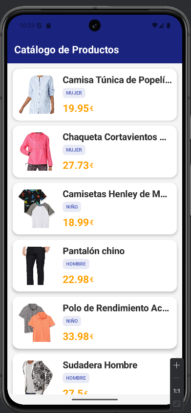

# App Retrofit - Catálogo de Productos 📱

Este proyecto es una aplicación nativa para Android desarrollada en **Kotlin** que demuestra la integración de servicios REST externos mediante **Retrofit**. La interfaz ha sido diseñada íntegramente con **Jetpack Compose**, siguiendo las guías actuales de desarrollo moderno en Android.

---

## 📸 Vista Previa

A continuación se muestra el resultado final de la aplicación consumiendo y renderizando los datos en tiempo real desde la API:

<p align="center">
  
</p>

---

## 🎯 Objetivos del Proyecto

El desarrollo se centra en la implementación de los siguientes pilares:

* **Diseño Moderno:** Uso de **Jetpack Compose** para una UI declarativa y reactiva.
* **Consumo de API:** Configuración de un cliente HTTP con **Retrofit**.
* **Asincronía:** Implementación de **Coroutines** para realizar peticiones de red sin bloquear el hilo principal.
* **Arquitectura MVVM:** Separación de lógica de negocio y UI mediante **ViewModel** y **Repository**.

## 🛠️ Stack Tecnológico

* **Lenguaje:** [Kotlin](https://kotlinlang.org/)
* **UI:** [Jetpack Compose](https://developer.android.com/jetpack/compose)
* **Red:** [Retrofit 2](https://square.github.io/retrofit/) + GSON Converter.
* **Imágenes:** [Coil](https://coil-kt.github.io/coil/) (Image loading library).
* **Arquitectura:** MVVM (Model-View-ViewModel).

---

## 🔌 Detalles de la API

La aplicación se conecta al siguiente endpoint público:  
`https://peticiones.online/api/products`

### Notas de Implementación:
* **Paginación:** Aunque la API ofrece metadatos de paginación (`page`, `total_pages`), siguiendo los requisitos de la actividad, se realiza una **única petición simple**.
* **Manejo de Datos:** La lógica se centra exclusivamente en extraer y mapear el array `results` del JSON devuelto.

**Estructura del Objeto Producto:**
```json
{
  "_id": "6374...",
  "name": "Nombre del producto",
  "description": "Descripción detallada",
  "price": 0.0,
  "category": "categoría",
  "image": "url_de_la_imagen",
  "active": true
}
